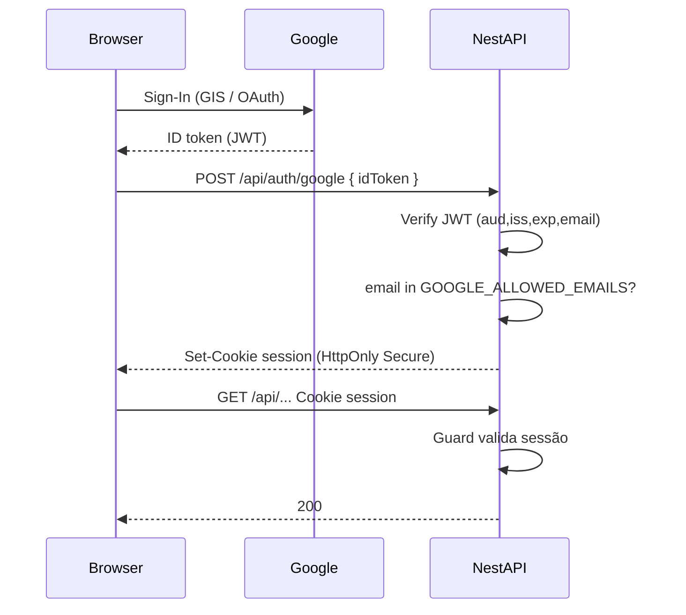

# Plano de segurança: Google SSO + hardening (pré-GCP)

Objetivo: substituir HTTP Basic Auth por autenticação forte com Google e fechar buracos antes do deploy no Cloud Run, para o app pessoal não expor Organizze/Pluggy/Neon.

---

## 1. Situação atual (auditoria)

### O que já está ok

| Item | Status |
|------|--------|
| Secrets Organizze/Pluggy só no servidor | OK — env vars, não vão pro bundle Vite |
| Helmet no Nest | OK (CSP relaxado só em dev) |
| `ValidationPipe` whitelist + forbidNonWhitelisted | OK |
| Prisma / Neon atrás da API | OK |
| HTTPS no Cloud Run | OK (TLS gerenciado) |
| SPA + API same-origin em prod | OK — reduz risco de CORS aberto |

### Riscos / fraquezas do Basic Auth atual

1. **Senha no `sessionStorage`** (`web/src/App.tsx`) — qualquer XSS futuro rouba `appUser`/`appPassword` e acessa a API.
2. **Credencial enviada em todo request** (`Authorization: Basic …`) — fica em histórico de rede, logs de proxy, extensões.
3. **Um único usuário/senha compartilhável** — sem MFA, sem revogação por conta Google, senha fraca = app aberto.
4. **Estáticos da SPA provavelmente sem guard** — em prod, `useStaticAssets` + fallback `index.html` são middleware Express; o `BasicAuthGuard` global protege **controllers Nest** (`/api/*`). Qualquer um pode baixar o HTML/JS (não tem secrets, mas a UI fica pública). A API continua protegida.
5. **`/api/health` público** — aceitável; não vazar detalhes de versão/env.
6. **Sem rate limit / lockout** — brute-force do Basic é trivial se a URL for pública e a senha fraca.
7. **Sem allowlist de e-mail** — quem souber user/pass entra.

Conclusão: para uso local com senha forte, “serve”. **Para URL pública no GCP, Basic Auth não é o nível certo.** Google SSO (ou IAP) resolve o ponto principal.

---

## 2. Opções de autenticação (GCP)

### Opção A — Cloud IAP na frente do Cloud Run (recomendado se aceitar GCP IAP)

```text
Browser → IAP (Google login + allowlist) → Cloud Run (Nest)
```

- Login Google gerenciado pelo Google; só e-mails/grupos allowlisted.
- App quase não implementa auth (opcional validar JWT `X-Goog-IAP-JWT-Assertion`).
- MFA do Google Account “de graça”.
- Custo: IAP tem free tier generoso para uso pessoal baixo.
- Limitação: auth amarrada ao GCP; localhost precisa bypass (dev sem IAP + auth app, ou túnel).

### Opção B — Google OAuth / OIDC **dentro do Nest** (recomendado se quiser auth no app)

```text
Browser → Google Sign-In → ID token → Nest valida → cookie de sessão HttpOnly
Todas as /api/* exigem sessão (exceto health + callback OAuth)
```

- Funciona igual em localhost e Cloud Run.
- Allowlist: `GOOGLE_ALLOWED_EMAILS=seu@gmail.com`.
- Cookie: `HttpOnly`, `Secure`, `SameSite=Lax` (ou `Strict`), assinatura com `SESSION_SECRET`.
- Remover Basic Auth e senha do `sessionStorage`.
- Frontend: botão “Entrar com Google”; requests `credentials: 'include'`.

### Opção C — IAP + validação no app

Máxima defesa em profundidade; mais trabalho. Útil se quiser API inacessível mesmo com IAP misconfiguration.

**Proposta deste plano: Opção B** (Google OIDC no Nest) como caminho principal — alinha com “remover Basic Auth e adicionar Google SSO” e funciona em dev + GCP sem depender de IAP. Opcionalmente documentar IAP como camada extra depois.

---

## 3. Desenho alvo (Opção B)

### Fluxo



### Backend

| Peça | Detalhe |
|------|---------|
| Lib | `google-auth-library` para `verifyIdToken` |
| Sessão | `cookie-session` ou `iron-session` / JWT assinado em cookie (preferência: cookie opaco ou JWT curto assinado com `SESSION_SECRET`, TTL 7d, sliding opcional) |
| Env | `GOOGLE_CLIENT_ID`, `GOOGLE_ALLOWED_EMAILS`, `SESSION_SECRET` (32+ bytes) |
| Remover | `APP_USER`, `APP_PASSWORD`, Passport Basic, login form com senha |
| Guard | `SessionAuthGuard` global; `@Public()` em `/api/health`, `POST /api/auth/google`, `POST /api/auth/logout` |
| Estáticos | Em prod, exigir sessão **ou** aceitar SPA pública (só API sensível). Preferência: **SPA pode ficar pública**; API sempre autenticada. Não colocar secrets no frontend. |

### Frontend

| Peça | Detalhe |
|------|---------|
| Google Identity Services | botão One Tap / Sign in with Google com `GOOGLE_CLIENT_ID` (público, ok no bundle) |
| Login | troca ID token por cookie via `POST /api/auth/google` |
| API | `fetch(..., { credentials: 'include' })` — sem `Authorization: Basic` |
| Estado | `GET /api/auth/me` para saber se está logado; logout limpa cookie |
| Remover | `sessionStorage` de senha/usuário |

### Allowlist

```env
GOOGLE_ALLOWED_EMAILS=voce@gmail.com
```

Qualquer outro e-mail Google → `403` mesmo com token válido.

---

## 4. Hardening adicional

Implementado em `PLAN-security-harden.md`:

1. **Cookie flags** — `Secure` em prod, `HttpOnly`, `SameSite=Lax`, path `/`.
2. **Sessão server-side** — token opaco no cookie; hash no Neon; logout/novo login revogam.
3. **Idle 12h + absolute 7d** com sliding touch (≥5 min).
4. **CSRF** — `SameSite=Lax` + checagem de Origin/Referer em mutações.
5. **Helmet CSP em prod** — GIS (`accounts.google.com`).
6. **Não logar tokens** — ID token / cookie nunca no `Logger`.
7. **Rate limit** — `POST /api/auth/google` 10/min/IP; global 120/min; health isento.
8. **Secret Manager** — secrets no GCP no deploy; nunca no git.
9. **Cloud Run** — auth no app; HTTPS only.
10. **Health** — público, resposta mínima.

---

## 5. O que NÃO muda

- Credenciais Organizze/Pluggy continuam **só no servidor**.
- Modelo de dados Prisma / Neon.
- Features de conciliação / saldos.

---

## 6. Critérios de “app seguro o bastante” para subir

- [ ] Basic Auth removido (API e UI).
- [ ] Login só via Google; allowlist de e-mail ativa.
- [ ] Sessão só em cookie HttpOnly Secure; nada de senha no `sessionStorage`.
- [ ] Chamadas `/api/*` (exceto health/auth públicos) retornam 401 sem cookie.
- [ ] Secrets só em env / Secret Manager.
- [ ] Teste manual: e-mail fora da allowlist → 403.
- [ ] Teste manual: logout → requests seguintes 401.
- [ ] README atualizado com setup Google Cloud Console (OAuth client, origins).

---

## 7. Fases de implementação

1. **Auth Google no Nest** — verify ID token, allowlist, cookie session, guard, `/auth/me` `/auth/logout`.
2. **Frontend** — GIS button, credentials include, remover Basic login.
3. **Env + docs** — `.env.example`, README, remover `APP_*`.
4. **CSP / helmet ajustado** para GIS.
5. **Checklist de deploy GCP** (secrets, OAuth authorized origins = Cloud Run URL).

---

## 8. Decisão pedida

Implementar **Opção B (Google OIDC no app + allowlist)** conforme este plano.

Se preferir **só IAP** (Opção A) sem código OAuth no Nest, avisar — o desenho muda (menos código no app, mais config GCP).
